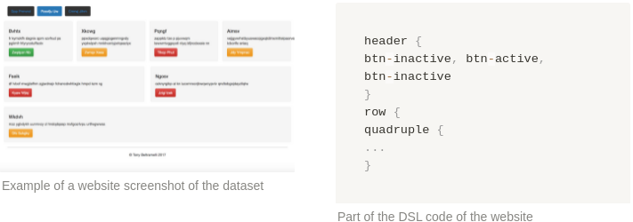
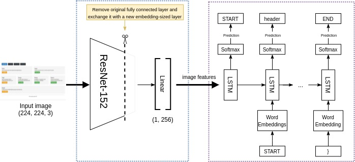

# Project documentation

Generating HTML code from a screenshot of a website.

## About this guide:

This document is primarily intended for software engineers and data scientists.

**What to expect:**

After this guide you will:

- have a basic overview of the architecture of the model
- have an overview over the code implementation

For setup instructions, refer to primary [readme](../README.md) file.

# Project structure

```python
tests/.                        # Automated tests
transpilers/html_transpiler/
├─ html_transpiler.py          # transpiles tokens into actual HTML code
├─ web-dsl-mappings            # e.g. "big-title": "<h2>[]</h2>"
├─ node.py                     # representation + rendering of html structure
├─ utils.py
data/                          # see README.md
build_vocab.py                 # build the vocab based on dataset
dataset.py                     # class representing the dataset
evaluate.py                    # script to evaluate model
models.py                      # definition of the models (Encoder + Decoder)
split_data.py                  # split data into training-, validation-, test-set
train.py                       # script to train the model
visualize_inference.ipynb      # jupyter Notebook to visualize the predicted HTML
vocab.py                       # class containing the vocab + helper functions
```

# Data

A single training example consists of a) a screenshot of a website, and b) the corresponding code of the website. The "code" is a simple domain-specific language (DSL) that has been derived from standard HTML & CSS code. For example, `<header><button/></header>` is simply `header { button }` in the DSL.

The predictions of the model are in the form of the DSL. The transpiler utility is responsible for transpiling DSL back to valid HTML, in order to be able to render the website.



## **Splitting the dataset**

In order to train, validate and test the model, the entire dataset gets split into the following three separate sets: "train", "validation" and "test".

For each of the splits, we generate a text file that contains all the ids of the data examples for that specific split. The ids reference filenames inside the data folder that contains all image files (`.png`) and corresponding DSL files (`.gui`). For example, the `training.txt` file contains ~1045 lines of file ids.

For better reproducibility, the  `split_data.py` script always splits a given dataset into exactly the same three subsets. This means that on different machines, with the same data set and the same splitting ratio, the samples in the train, validation, and test set are exactly the same.

To understand how to run the `split_data.py` script have a look at [README](https://github.com/timoangerer/pix2code-pytorch#readme).

## Building and using the vocabulary

The first pre-processing step for the textual data is the tokenization of the image descriptions into tokens. The descriptions consist of single words of the DSL language separated by whitespace, so the tokenization simply splits the description at whitespace.

We don't need any other common NLP pre-processing steps, since we are dealing with an artificially created DSL language and not actual natural language.

Next, each unique token gets mapped to an id, which is necessary for fast matrix and vector operations with numerical values. The resulting map is called the vocabulary. When loading a data example, each token in the description gets mapped to its id before being passed to the model.

We create the vocabulary out of all the unique tokens that are found in the dataset. This is possible due to the small number of unique tokens found in the dataset (15 total). For datasets with a large vocabulary it advisable to specify a word frequency threshold under which less frequent words are put into a single class i.e "other".

To build the vocabulary run the `build_vocab.py` script. Take a look at [README](https://github.com/timoangerer/pix2code-pytorch#readme) for more details on how to run it.

The script creates a vocabulary that consists of all the unique DSL tokens that are present in the entire dataset and stores the unique tokens in the `vocab.txt` file located in the `data/` folder.

**Example** of generated vocabulary (`data/vocab.txt`):

```
quadruple text header btn-orange } btn-red double { single small-title btn-active , row btn-inactive btn-green
```

**Vocabulary class**

The vocabulary class found in `vocab.py` represents the token-to-id-mappings.

The class reads the vocabulary from the file one by one and creates two maps, mapping from **tokens** to **ids** and vice versa. This allows instant lookup of tokens by their id while the model is translating.

The vocabulary also contains a multiple of special tokens:

- Tokens for the start (`START`) and end (`END`) of a description. This allows the model to specify when its predicted description starts and ends. This is necessary since all predicted sequences have a unified length but might actually be shorter. (Shorter predictions get filled up with `PADDING` token after `END` token)
- Padding token (`PADDING`). The descriptions vary in length but need to have the same length when processed as a batch. The padding token is used to fill the empty spots of shorter descriptions.
- Unknown token (`UNKOWN`). The "unknown" token is used for any token that is not present in the vocabulary.

The vocabulary is saved under the `vocab` key within the model file, so loading a trained model also loads the vocabulary the model was trained on.

**Example of initialized `vocab` class:**

Given this vocab file: 

```
quadruple text header btn-orange } btn-red double { single small-title btn-active , row btn-inactive btn-green
```

And these init_tokens:

```python
[START_TOKEN, END_TOKEN]
```

The resulting mappings will look like this:

```python
token_to_id: {
	"START": 1,
	"END": 2,
	"PADDING": 3,
	"UNKNOWN": 4,
	"quadruple": 5,
	"text": 6,
	...
	"btn-green": 19
}
id_to_token: {
	1: "START",
	2: "END",
	3: "PADDING",
	4: "UNKNOWN",
	5: "quadruple",
	6: "text",
	...
	19: "btn-green"
}
```

## **Dataset class**

The dataset class is responsible for returning a single sample in the correct shape required by the model.

The required shape for the model is a tuple containing two variables:

- Description of website: array of correct token ids
- Image of website: image transformed by transformer function (tensor)

The images get resized, converted into PyTorch tensors, and finally normalized by the transformer function. These transformations are required by the resnet152 model.

The dataset contains all the samples of the respective data-set. Since the class only reads the file containing the filenames and not all the actual files, it is memory efficient and fast. Only as soon as a sample is required, it loads and parses the actual files.

## **Data Loader**

The DataLoader is responsible for sampling the data from the dataset as small batches.

The DataLoader provides an iterator over all the batches. Processing a batch requires the data within to have the same shape. Since the sequences of tokens can have different lengths, the DataLoader has to pad shorter sequences to the longest one. Bringing all samples in a batch to the same length gets handled by the `collate_fn`.

The `collate_fn` function finds the length of the longest token sequence and then fills up the shorter token sequences with the `PADDING` token.

Another way of implementing the `collate_fn` would have been to first check the longest sequence in the dataset and pass it to the function and then pad all sequences to that length. However, it is more efficient padding only to the longest sequence of the current batch since this could be shorter than the `total_max_length` and thus saving the model time iterating over lots of unnecessary pad tokens.

# Model architecture



Overview of the entire architecture

## **Encoder**

The encoder is a CNN (specifically a ResNet152). Its input is a 224x224 RGB image of a website. This network acts as a feature extractor of the input image, passing the image through the network produces a 256 (embedding size) elements representation of the defining features of the image. These features are then used as input for the decoder model.

The ResNet uses pre-trained weights of ImageNet. It is necessary to remove the last fully connected layer that represents the original ImageNet classes and exchange it with a layer with the length of the embedding size.

Only the last, newly added layer, is being trained. The other weights are left unchanged.

## **Decoder**

The decoder is an RNN (specifically an LSTM). Its inputs are the features of the input image (which has been extracted by the CNN) and a sequence of tokens. It predicts the next token in the sequence one at a time until it predicts the end of a sequence. Start and end are marked with the special tokens `START` and `END`.

Training and testing/inference mechanisms are different for the decoder model:

For the training loop, we pass both the image features and the first target token to the model, and the model predicts the next token in the sequence. Then, the model is provided with the first two target tokens and predicts the next token, and so on. For example, if we have a target sequence of "START header { button } END", at the 3rd time step (think iteration), the model receives the target sequence "START header {" and the image features, based on which it should predict "button" as the next token.

During the testing/inference phase, we can not provide the model with the target sequence anymore. But the model needs to have a sequence of preceding tokens in order to predict the next token. To solve this problem, the decoder simply passes the currently predicted token sequence to the next input layer, building up the complete sequence step by step.

The textual input of the decoder has the form of word embeddings. Word embeddings are a way to represent words as numerical values in arrays in a memory-efficient manner i.e low dimensional continuous-valued vectors. Word embeddings give us a notion of how similar or related words are to each other, based on their geometric distance. Vectors that are closer to each other in space, are considered to be more related to each other. "Relatedness" is measured by how often words appear together with each other. The embedding representation allows us to give the model better feedback during training because it gives us a notion of "how wrong" the prediction was, not just a binary notion of either right or wrong.

The decoder does not use any pre-trained word embeddings, because the artificial domain-specific language is quite different from actual natural language.

## Inference explanation

Step-by-step example of how the model makes a single prediction:

1. Preprocessing screenshot image with DataLoader
    1. Load the image from file
    2. Resize, transform to tensor and normalize it with transformer function
2. Calling the Encoder with the transformed image (`encoder(image.unsqueeze(0))`)
    1. Pass image tensor through modified Resnet152
    2. Pass output of Resnet152 through custom trained last linear layer + BatchNorm layer
    3. Return extracted features
3. Calling the Decoder with the extracted features (`decoder.sample(features)`)
    1. Inside the decoder.sample() method, initialize the array of the currently predicted sequence as an empty array and define a for-loop that runs to the largest possible sequence length of the dataset.
    2. At each step of the loop, pass the currently predicted sequence and image features to the LSTM to get the next token, and embed this token into the current sequence. Repeat until the loop ends.
    3. Return the final sequence array (this is the predicted sequence of tokens).

## Training explanation

Setp-by-step example of how one training-batch gets passed though the model:

1. Preprocessing screenshot image with DataLoader
    1. Load the image from file
    2. Resize, transform to tensor and normalize image with transformer function
2. Calling the `encoder.forward()` with the transformed images (`encoder(image.unsqueeze(0))`)
    1. Pass images through resnet152
    2. Pass output of resnet152 through linear layer
    3. Pass output of linear layer though BatchNorm layer
    4. return output of BatchNorm layer (256 extracted features)
3. Calling the `decoder.forward()` with the extracted features (`decoder.sample(features)`)
    1. Create word embeddings from captions
    2. Concatenate embeddings and images features
    3. Pass packed features though LSTM
    4. Pass output of LSTM though linear layer
    5. return output of linear layer (predictions)
4. Compute the loss depending on prediction and targets + gradients for optimizer
5. Call `optimizer.step()`, optimizes model parameters with gradients from `loss.backwards()`
    1. Updates the parameters of the decoder model
    2. Updates the parameters of encoder model (Last linear layer + Last BatchNorm Layer)

# Other

## **Hyperparameters**

We adopted the hyperparameters used for training the model from models used for similar use-cases to save time. We haven't had the time to tune them to this use case yet, so there is room for improvement.

## **Checkpoints & saving models**

After a couple of epochs, we create a model checkpoint. The model checkpoint contains all the necessary variables in order to later load the model for inference, but also to resume training from this checkpoint. The variables are: epoch, encoder model state dict, decoder model state dict, optimizer_state_dict, loss, vocabulary

Note: To use the model for inference/predictions, it only needs the encoder & decoder model dict and the vocabulary.

## **Optimizer**

The optimizer used for training is [torch.optim.Adam()](https://pytorch.org/docs/stable/optim.html#torch.optim.Adam). It is responsible for optimizing the parameters of the decoder model and the last fully connected layer that we added to the encoder network. Note that we don't want to optimize/change the parameters of the pretrained resnet152.

The optimizer object holds the current state and updates the parameters according to the computed gradients. 

[Adam optimization algorithm](https://arxiv.org/abs/1412.6980)

# Evaluating the model

Measuring the accuracy of translation models can be tricky. For example, if you would compare word by word and your prediction is one word out of sync, you would end up with 0% accuracy. However, if you then would remove or add a word that would sync the prediction, you might get very high accuracy. Having such big differences in scores for very similar predictions is not good for evaluation.

A better way for evaluating matric for NLP problems is called "BLEU score". It has the advantages that it is quick and inexpensive to compute, language-independent and it correlates highly with human evaluation. It compares the predicted sequence with the target sequence and tells us the proportion of how many tokens corresponded to the tokens in the target sequence. The BLEU score doesn't take into account the order of the tokens in a sequence. Another advantage is that if your prediction contains all tokens within the target sequence however also some additional ones or less, the score decreases.

# References & credits

- Tony Beltramelli for the original pix2code [paper](https://arxiv.org/pdf/1705.07962.pdf) and the [dataset](https://github.com/tonybeltramelli/pix2code).
- Imagine captioning tutorials: [Basic idea of image captioning](https://machinelearningmastery.com/develop-a-deep-learning-caption-generation-model-in-python/), [Image captioning PyTorch](https://github.com/yunjey/pytorch-tutorial/tree/master/tutorials/03-advanced/image_captioning), [image captioning TensorFlow](https://blog.insightdatascience.com/automated-front-end-development-using-deep-learning-3169dd086e82)
- [Show, attend and tell](https://arxiv.org/pdf/1502.03044.pdf) paper for image captioning